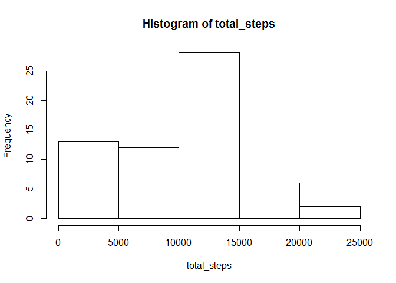
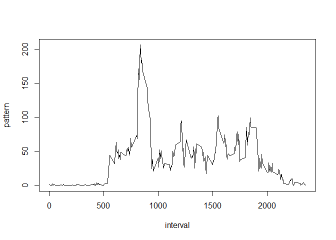
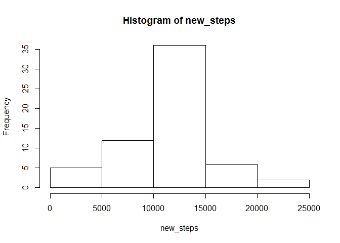
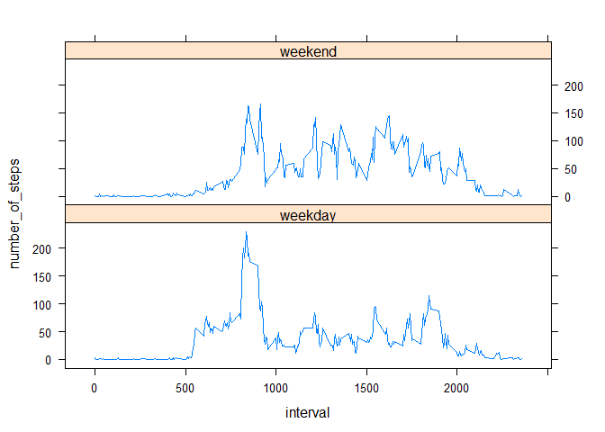

# Reproducible Research: Peer Assessment 1
## Initilization of libraries

```r
# using warning = FALSE and message = FALSE to supress messages
library(ggplot2)
library(lattice)
library(dplyr)
```

## Loading and preprocessing data

```r
data<-read.csv("activity.csv")
data$date<-as.Date(as.character(data$date))
```


## What is mean total number of steps taken per day?

```r
data<-group_by(data,date)
total_steps <- summarise(data, sum(steps, na.rm=TRUE))[[2]]
hist(total_steps)
```

 

```r
mean_daily_steps<-mean(total_steps)
median_daily_steps<-median(total_steps)
```
Mean daily steps: 9354.2295082  
Median daily steps: 10395

## What is the average daily activity pattern?


```r
data<-group_by(data, interval)
pattern<-summarise(data, mean(steps, na.rm = TRUE))[[2]]
interval<-summarise(data, mean(steps, na.rm = TRUE))[[1]]
plot(interval, pattern, type = "l")
```

 


##Imputing missing values

```r
avg_steps_per_interval<- cbind(pattern, interval)
data2<- merge(data, avg_steps_per_interval)
missing<- is.na(data2$steps)
num_missing<-sum(missing)
data2$steps[missing]<-data2$pattern[missing]
data2<-select(data2, -pattern)
data2<-arrange(data2, date, interval)
data2<-group_by(data2, date)
new_steps<- summarise(data2, sum(steps, na.rm=TRUE))[[2]]
hist(new_steps)
```

 

```r
mean_daily_steps2<-mean(new_steps)
median_daily_steps2<-median(new_steps)
```
Number of missing values in "steps": 2304  
Mean daily steps: 1.0766189\times 10^{4}   
Median daily steps: 1.0766189\times 10^{4}  

After imputing missing values, mean and median number of total dailiy steps has gone up.  


## Are there differences in activity patterns between weekdays and weekends?


```r
data2$day<-weekdays(data2$date)
data2$weekend[data2$day == "Sunday"]<-"weekend"
data2$weekend[data2$day == "Monday"]<-"weekday"
data2$weekend[data2$day == "Tuesday"]<-"weekday"
data2$weekend[data2$day == "Wednesday"]<-"weekday"
data2$weekend[data2$day == "Thursday"]<-"weekday"
data2$weekend[data2$day == "Friday"]<-"weekday"
data2$weekend[data2$day == "Saturday"]<-"weekend"
data2$weekend<-as.factor(data2$weekend)
data2<-group_by(data2,weekend, interval )
temp<-summarize(data2, mean(steps, na.rm=TRUE))
weekday<-as.character(temp$weekend) == "weekday"
weekend<-as.character(temp$weekend) == "weekend"
weekday_data<- temp[[3]][weekday]
weekday_data<-temp[[3]][weekend]
names(temp)<- c("weekend", "interval", "number_of_steps")
xyplot(number_of_steps ~ interval | weekend, data=temp, layout =  c(1,2), type = "l")
```

 
